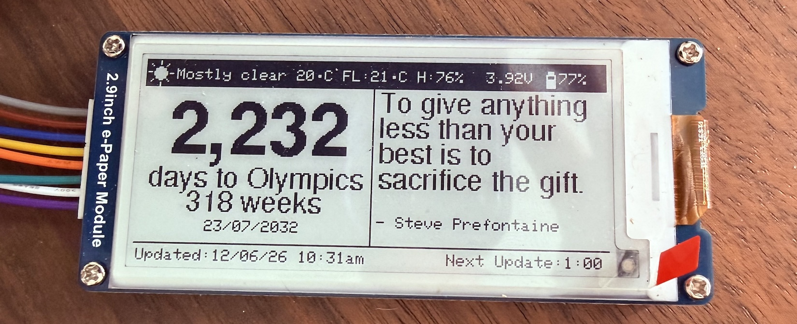
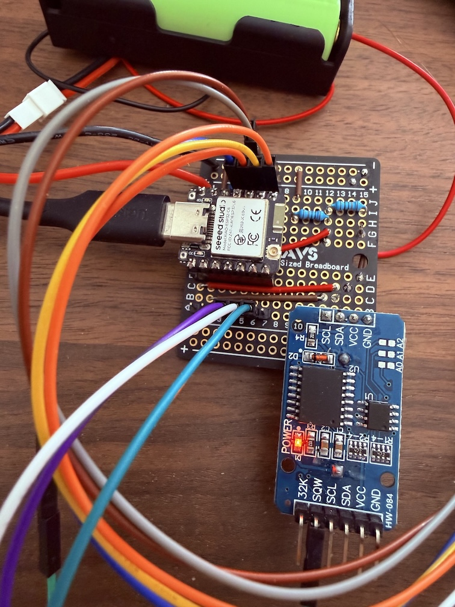
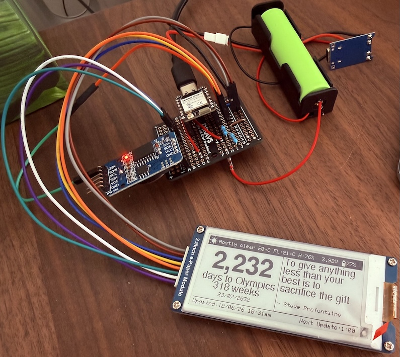
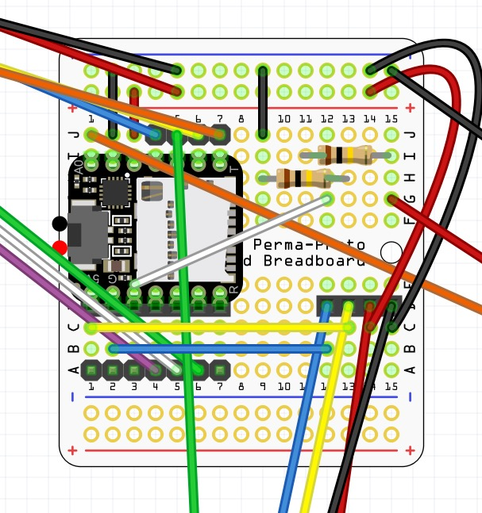
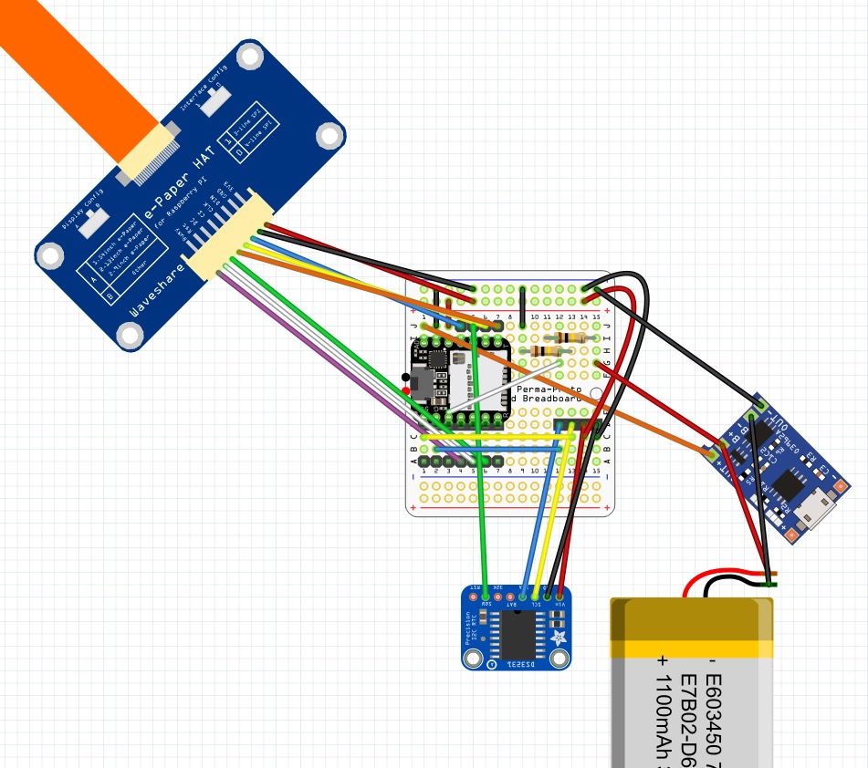

# Brisbane 2032 Counter

A battery-powered e-paper display that counts down the days to Brisbane 2032 (23/07/2032), showing live weather, a daily quote, and battery status. Built on the Seeed XIAO ESP32-C6 with a Waveshare 73.5mm 296x128 B/W Rev2.1 e-paper display.

---

## Display Layout

```
+-------------------------------------------------------------+
| [icon] Clear 23C FL:26C H:68%              [bat] 85%        |  <- Topbar
+----------------------------+--------------------------------+
|                            |                                |
|          1,302             |  You only live once, but       |
|    days to Brisbane 2032   |  once is enough.               |
|        186 weeks           |                                |
|        23/07/2032          |  - Mae West                    |
+----------------------------+--------------------------------+
| Updated: 08/06/26 9:28am          Next Update: 1:00pm       |  <- Footer
+-------------------------------------------------------------+
         296 x 128 pixels
```



---

## Hardware

| Component | Model | Notes |
|-----------|-------|-------|
| Microcontroller | [Seeed XIAO ESP32-C6](https://www.seeedstudio.com/Seeed-Studio-XIAO-ESP32C6-p-5884.html) ([Wiki](https://wiki.seeedstudio.com/xiao_esp32c6_getting_started/)) | Wi-Fi 6, deep sleep capable |
| Display | [Waveshare 73.5mm 296x128 e-Paper B/W Rev2.1](https://www.waveshare.com/wiki/2.9inch_e-Paper_Module_(B)) | 296x128px, GDEY029T94 driver |
| RTC | DS3231 AT24C32 IIC module | Coin battery backup, +/-2ppm accuracy |
| Battery | Panasonic NCR18650B | ~3400mAh |
| Charger | TP4056 5V 1A with protection | USB-C input, OUT+/OUT- protected output |
| Protoboard | Dikavs Perma-Proto 1/4 size | Permanent soldered connections |

---

## Pin Assignments

### E-Paper Display (SPI)

| Signal | XIAO Pin | GPIO | Notes |
|--------|----------|------|-------|
| MOSI (DIN) | D10 | GPIO18 | Hardware SPI MOSI |
| SCK (CLK) | D8 | GPIO19 | Hardware SPI SCK |
| CS | D7 | GPIO17 | Chip select |
| DC | D5 | GPIO23 | Data/command |
| RST | D4 | GPIO22 | Reset |
| BUSY | D3 | GPIO21 | Do NOT use D6 (GPIO16 = UART TX) |
| VCC | 3V3 | -- | |
| GND | GND | -- | |

> **Important:** D6 (GPIO16) is UART0 TX by default. Using it as BUSY causes `_Update_Full` to complete in ~7ms instead of ~1,640,000ms because `Serial.begin()` holds the pin HIGH permanently, making GxEPD2 think the display is never busy. Always use D3-D5 for BUSY. Refer to [Issue 46](https://github.com/Seeed-Studio/platform-seeedboards/issues/46) for more info.

### RTC DS3231 (I2C) -- connect to right-side 4-pin header

| Signal | XIAO Pin | GPIO | Notes |
|--------|----------|------|-------|
| SDA | D0 | GPIO0 | LP_GPIO -- safe with variant.cpp fix |
| SCL | D1 | GPIO1 | LP_GPIO -- safe with variant.cpp fix |
| SQW/INT | D9 | GPIO20 | Reserved for future alarm wake |
| VCC | 3V3 | -- | |
| GND | GND | -- | |

> The DS3231 module also has a 6-pin header on the left side (32K, SQW, SCL, SDA, VCC, GND). Use the **right-side 4-pin header** for I2C. The left-side SQW pin is connected to D9 for potential future deep sleep alarm use.

### Battery Voltage Divider (ADC)

| Point | Connects to | Notes |
|-------|-------------|-------|
| Top of R1 | TP4056 B+ | Raw battery voltage |
| Middle junction (R1+R2) | D2 / A2 (GPIO2) | ADC read point |
| Bottom of R2 | GND | |

- R1 = R2 = 100kOhm (measure and match closely -- batch tolerance can be +/-25%)
- Divider ratio: 1:2 -- multiply ADC voltage x2 for actual battery voltage
- Calibration factor in code: `CAL_FACTOR = real_voltage / calculated_voltage`

### Power (TP4056 to XIAO)

| TP4056 Pin | Connects to | Notes |
|------------|-------------|-------|
| OUT+ | XIAO 5V | Protected output -- powers ESP32 |
| OUT- | GND | Common ground |
| B+ | Battery red + R1 top | Raw battery voltage |
| B- | Battery black + GND | |

> **Never connect battery+ directly to the 3V3 rail.** Always power the XIAO from TP4056 OUT+ to the 5V pin. The onboard regulator steps it down to 3.3V.

---

## Protoboard Layout

```
     1  2  3  4  5  6  7  8  9  10 11 12 13 14 15
+  ──────────────────────────────────────────────── +
A  [======= 7P male header (display connector) ===]
B  [ wire links A-D per column                    ]
C  [ wire links A-D per column                    ]
D  [======= 7P female header (XIAO left side) ====]
     <- XIAO straddles centre gap ->
E
F
G  [======= 7P female header (XIAO right side) ===]
H  [ wire links G-J per column    ] [R1] [R2]      ]
I  [ wire links G-J per column    ] [4P RTC hdr]   ]
J  [======= 7P male header (display connector) ===]
-  ──────────────────────────────────────────────── -
```

- Columns A-D and G-J are bridged with short wire links on the copper side
- Display female wires plug into the male headers at rows A and J
- XIAO plugs into female headers at rows D and G
- RTC plugs into 4P female header in H/I area
- Resistors soldered directly into board







## Fritzing Layout






---

## Software

### Dependencies (platformio.ini)

```ini
lib_deps =
    zinggjm/GxEPD2 @ ^1.6.2
    adafruit/Adafruit GFX Library @ ^1.11.9
    adafruit/RTClib @ ^2.1.4
    bblanchon/ArduinoJson @ ^7.0.0
```

### Platform

```ini
platform = https://github.com/pioarduino/platform-espressif32/releases/download/stable/platform-espressif32.zip
```

Uses the **pioarduino** fork of the Espressif platform for full Arduino 3.x / ESP32-C6 support. The official PlatformIO `espressif32` platform does not fully support the C6.

### secrets.h (not committed)

Create `src/secrets.h` with your Wi-Fi credentials:

```cpp
#pragma once
#define WIFI_SSID     "your_wifi_ssid"
#define WIFI_PASSWORD "your_wifi_password"
```

This file is excluded from Git via `.gitignore`.

---

## How It Works

### Update cycle
1. ESP32 wakes up (from deep sleep on battery, or wait loop on USB)
2. Reads current time from DS3231 RTC
3. Connects to Wi-Fi
4. Fetches weather from Open-Meteo API (free, no API key)
5. Syncs RTC time from NTP (AEST UTC+10, no DST -- Queensland)
6. Reads battery voltage via ADC
7. Draws screen
8. Disconnects Wi-Fi
9. Goes to deep sleep until next scheduled update (7:00am or 1:00pm)

### Update schedule
- 7:00am -- weather, quote, battery update
- 1:00pm -- weather, quote, battery update
- The rest of the time -- deep sleep, no updates

### Weather API

Open-Meteo -- free, no API key required:

```
https://api.open-meteo.com/v1/forecast
  ?latitude=-26.3927&longitude=153.0386
  &current=temperature_2m,apparent_temperature,relative_humidity_2m,weather_code
  &timezone=Australia/Brisbane
```

### Quote of the day

Stored locally in `src/quotes.h` as an array of structs. Quote selected by:
```cpp
int quoteIndex = dayOfYear % QUOTE_COUNT;
```
Changes daily, no network required.

### Battery monitoring

Two 100kOhm resistors form a voltage divider between TP4056 B+ and GND. The midpoint connects to GPIO2 (A2). `analogReadMilliVolts()` reads the calibrated ADC value, multiplied by 2 to get actual battery voltage. A small vertical battery icon in the topbar shows charge level visually.

---

## Known Issues & Solutions

### `_Update_Full : 7` (display not refreshing)
Display BUSY pin reads HIGH immediately, driver thinks refresh is instant.
- **Cause:** BUSY connected to D6 (GPIO16 = UART0 TX). `Serial.begin()` holds pin HIGH.
- **Fix:** Move BUSY to D3 (GPIO21).

### LP_GPIO corruption (GPIO 0-7)
`digitalWrite()` fails with "IO x is not set as GPIO" on GPIO0-7.
- **Cause:** Arduino ESP32 periman abstraction has issues with LP_GPIO.
- **Status:** Already fixed in current pioarduino platform via `variant.cpp` (confirmed present in `~/.platformio/packages/framework-arduinoespressif32/variants/XIAO_ESP32C6/`).
- **Reference** See [Issue 46](https://github.com/Seeed-Studio/platform-seeedboards/issues/46#issuecomment-4656431041)

### `Network.h` not found
Compile error when using WiFi.
- **Fix:** Add to `platformio.ini` build flags:
```ini
-I/Users/YOUR_USERNAME/.platformio/packages/framework-arduinoespressif32/libraries/Network/src
```

### Deep sleep reset loop (USB powered)
ESP32 immediately resets after `esp_deep_sleep_start()` when powered via USB.
- **Cause:** USB CDC interferes with deep sleep.
- **Workaround:** Code detects USB power and uses a timed wait loop instead. Deep sleep works correctly on battery power only.

### RTC lost power on first boot
RTC time resets to compile time.
- **Cause:** Coin cell not yet charged, or first run.
- **Fix:** Automatic -- code detects `rtc.lostPower()` and sets compile time, then NTP sync corrects it on first WiFi connection.

### Battery ADC inaccuracy
ADC reading shifts depending on whether USB is connected alongside battery.
- **Cause:** ESP32-C6 ADC reference voltage changes with supply voltage.
- **Workaround:** Calibration factor applied in code. Two-point calibration recommended once battery has partially discharged.

---

## Build Status

| Feature | Status |
|---------|--------|
| E-paper display | Working |
| RTC timekeeping | Working |
| Countdown calculation | Working |
| Quote of the day | Working |
| Wi-Fi connection | Working |
| Live weather (Open-Meteo) | Working |
| NTP time sync | Working |
| Battery voltage ADC | Working (single-point calibration, two-point pending) |
| Deep sleep (battery) | Working |
| Final schedule (7am/1pm) | Working |
| Permanent protoboard wiring | Working |
| Custom PCB (KiCad V1) | In progress |
| INA219 battery monitor | Planned (V2) |

---

## File Structure

```
Brisbane2032_Counter/
├── src/
│   ├── main.cpp          # Main application code
│   ├── quotes.h          # Quote of the day array
│   └── secrets.h         # WiFi credentials (not committed)
├── kicad/
│   └── brisbane2032-counter-pcb/   # KiCad PCB project (V1)
├── platformio.ini        # PlatformIO build configuration
├── .gitignore
├── LICENSE
└── README.md
```

---

## Development Notes

- **IDE:** VSCode + PlatformIO
- **Flash command:** PlatformIO Upload button or `pio run --target upload`
- **Serial monitor:** 115200 baud -- send any key to force immediate refresh during wait loop
- **Flashing while sleeping:** Hold BOOT, unplug and replug USB, release BOOT to enter bootloader mode
- **RTC set:** Automatically set to compile time on first flash, then corrected via NTP

---

## Licence

This project is licensed under the GNU General Public License v3.0 --
see the [LICENSE](LICENSE) file for details.


